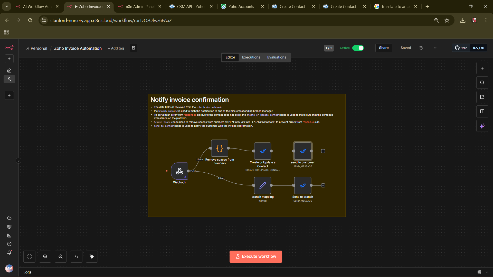

# Zoho Invoice Automation — Notify Invoice Confirmation

**Overview**
- **Purpose:** : Notify customers when an invoice is confirmed using an n8n workflow.
- **Trigger:** : The workflow is triggered by a `zoho books webhook` that sends invoice data.

- **Zoho Books side automation:** : The Zoho Books automation (see `images/Screenshot (686).png`) invokes this n8n workflow via the configured webhook. That Zoho automation is also responsible for sending email notifications to the customer and the branch manager (so the n8n workflow focuses on respond.io messaging and branch routing).

**Flow Summary**
- **Webhook:** : Receives invoice confirmation data payload from Zoho Books.
- **Branch Mapping:** : Maps the invoice to one of nine corresponding branch managers for routing.
- **Create or Update Contact:** : Ensures the customer exists on respond.io to avoid API errors when messaging.
- **Remove Spaces:** : Normalizes phone numbers (e.g., `971 xxxx xxx xxx` → `971xxxxxxxxxxx`) to meet respond.io formatting requirements.
- **Send to Contact:** : Sends the invoice confirmation message to the customer via respond.io.

**Node Details & Rationale**
- **`zoho books webhook`:** Receives the invoice confirmation event and provides all required fields (customer name, phone, invoice id, amount, branch identifier, etc.).
- **`branch mapping`:** Uses the branch identifier from the payload to select the correct branch manager contact or routing logic. There are nine possible branches.
- **`create or update contact`:** Calls respond.io's contact create/update endpoint so that when the workflow later calls `send to contact`, the API will not fail due to a missing contact record.
- **`remove spaces`:** Strips spaces from phone numbers and other formatting characters to produce a continuous numeric string (international format), preventing reject/validation errors from respond.io.
- **`send to contact`:** Sends a templated or custom invoice confirmation message to the validated contact.

**Importing This Workflow into n8n**
- **Export/Import:** Export this workflow as JSON from n8n, then in your n8n instance use `Import` → `From File` to add it.
- **Webhook URL:** After importing, copy the webhook URL from the `zoho books webhook` node and configure it in Zoho Books' webhook settings.
- **Credentials:** Ensure you configure credentials for Zoho Books and respond.io in n8n before activating the workflow.

**Configuration Tips & Troubleshooting**
- **Respond.io contact errors:** If respond.io returns a "contact not found" or similar error, confirm the `create or update contact` node runs before `send to contact` and inspect the contact payload.
- **Phone formatting:** Use the `Remove Spaces` node (or equivalent) to produce E.164-like phone numbers (country code + number) without spaces or punctuation.
- **Branch mapping failures:** Verify the mapping table includes all nine branch keys exactly as they appear in the Zoho payload (case-sensitive).
- **Testing:** Use n8n's node-execution panel to manually test each node and inspect input/output data for debugging.

**Files**
- **Workflow Export:** See `Zoho Invoice Automation.json` in this repository for the workflow JSON export.
- **Workflow Diagram:** `images/image.png` — visual overview of the node layout and data flow.
- **Zoho Books Automation Screenshot:** `images/Screenshot (686).png` — shows the automation configuration on the Zoho Books side that triggers the webhook and handles email delivery to customer and branch manager.

**Next Steps / Improvements**
- Add logging or persistent audit entries for each invoice notification.
- Add retry logic or error handling branches for respond.io API failures.
- Add unit tests or a staging webhook environment for safer validation before production activation.

If you want, I can also: export a clean workflow JSON, update the diagram, or add detailed sample payloads for testing.
